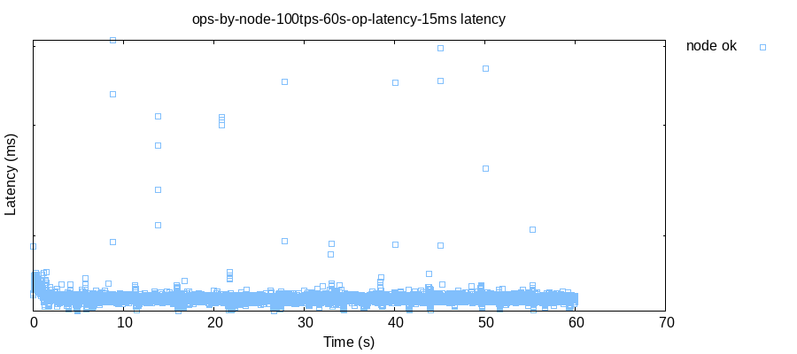

# jepsen-skeleton

A skelton Jepsen repository for bootstrapping new projects.

----

## no-op

Test is a minimal no-op.

```clj
{:db       db/noop
:nemesis   nemesis/noop
:generator (repeat {:type  :invoke
                    :f     :node
                    :value nil})}
```

### Client

Augments op map with `{:type :ok :value node}`.

```clj
(invoke!
  [{:keys [node op-latency] :as _this} _test op]
  ; simulate any desired latency?
  (when (< 0 op-latency)
    (u/sleep op-latency))  
  
  ; op is ok with a value of node
  (assoc op
         :type  :ok
         :value node))
```

### Checker

Calculates total ops by node.

```clj
(->> history
     (reduce (fn [summary {:keys [value] :as _op}]
               (update summary value (fn [old] (+ 1 (or old 0)))))
             (sorted-map)))```

----

## --workload

### --workload ops-by-node

Counts ops by node:

```clj
{:valid? true,
 :nodes ["n1" "n2" "n3" "n4" "n5"],
 :ops-by-node {"n1" 1919,
               "n2" 1009,
               "n3" 978,
               "n4" 977,
               "n5" 977}}
```

`--nodes n5,n4,n3,n2,n1`

```clj
{:valid? true,
 :nodes ["n5" "n4" "n3" "n2" "n1"],
 :ops-by-node {"n1" 960,
               "n2" 960,
               "n3" 963,
               "n4" 983,
               "n5" 1895}}
```

### --workload odd-nodes-only

`gen/on-threads` for odd numbered nodes only:

```clj
{:valid? true,
 :nodes ["n1" "n2" "n3" "n4" "n5"],
 :ops-by-node {"n1" 1936,
               "n3" 1952,
               "n5" 1949}}
```

----

## --op-latency ms

The amount of time, simulated latency, an op should take in ms.

`--op-latency 15`
```clj
{:valid? true,
 :nodes ["n1" "n2" "n3" "n4" "n5"],
 :ops-by-node {"n1" 1299,
               "n2" 1240,
               "n3" 1141,
               "n4" 1102,
               "n5" 1040}}
```


